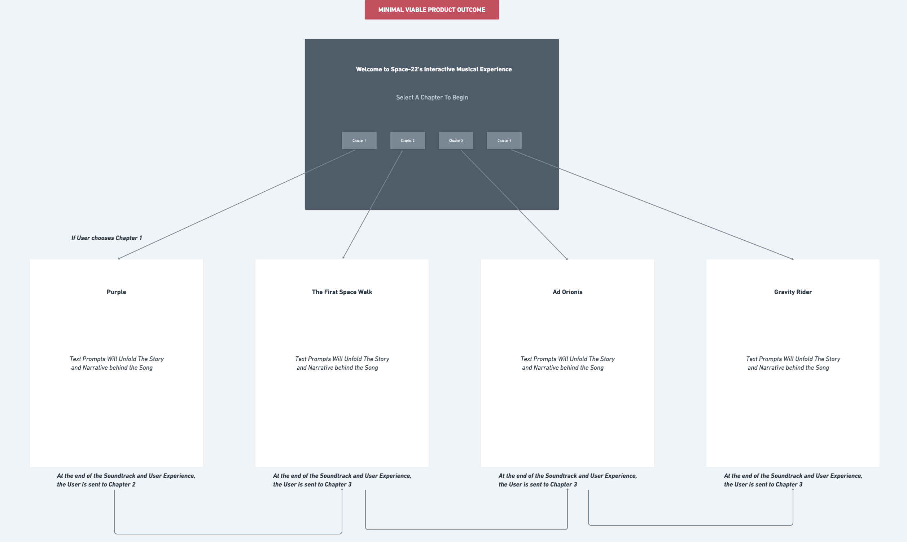

# Narrative Page Project
---
## Introduction
This project is a simple approach to creating an on-browser narrative with background music. Exploring the concepts of minimalist visuals with complex sounds are the basis for this project.

## User Experience Outline
1. User is presented a minimal dark page with introductory writing.
2. User chooses to begin the narrative experience. If the user has already experienced it, the user can choose to begin the narrative experience from a specific "chapter".
3. Each chapter contains a different visual experience accompanied by a completely different musical experience.

The overall experience is to accompany the sounds of musical tones to minimal visuals, to heighten the user's experience of each musical composition.

## Wireframes 

## Resources
1. Space-22 Soundtrack

